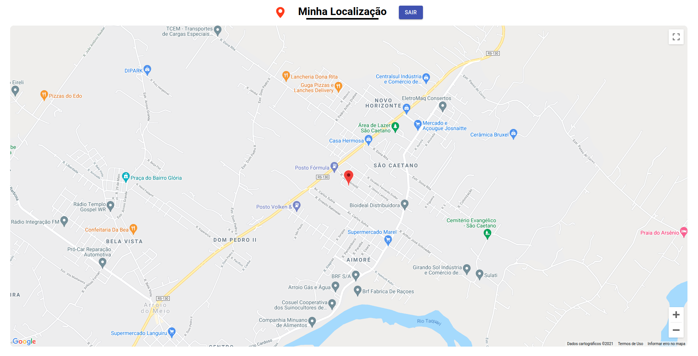
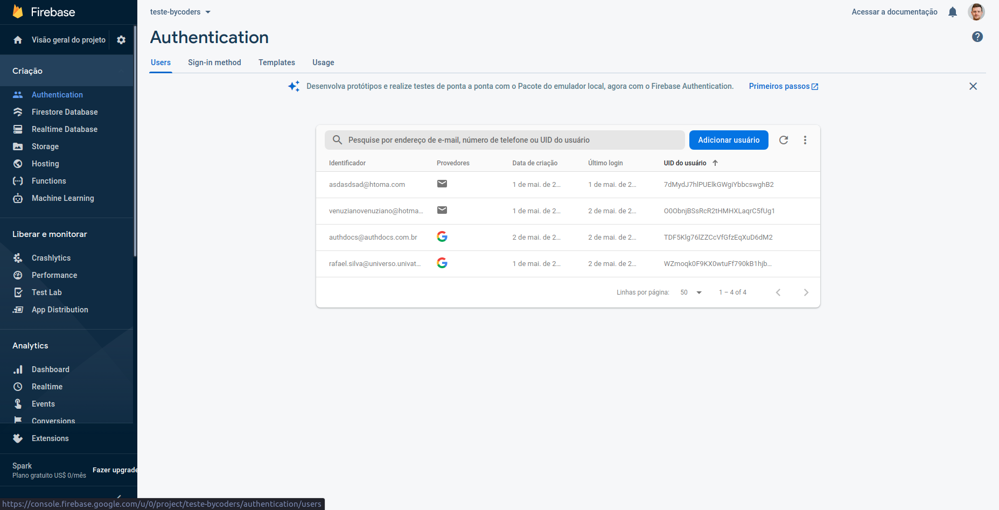
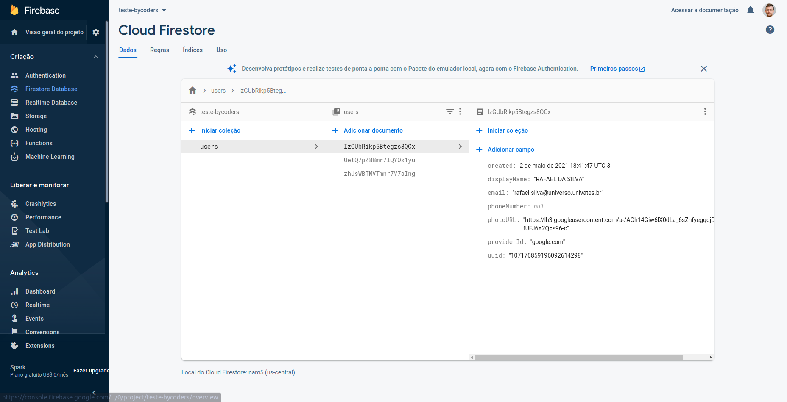
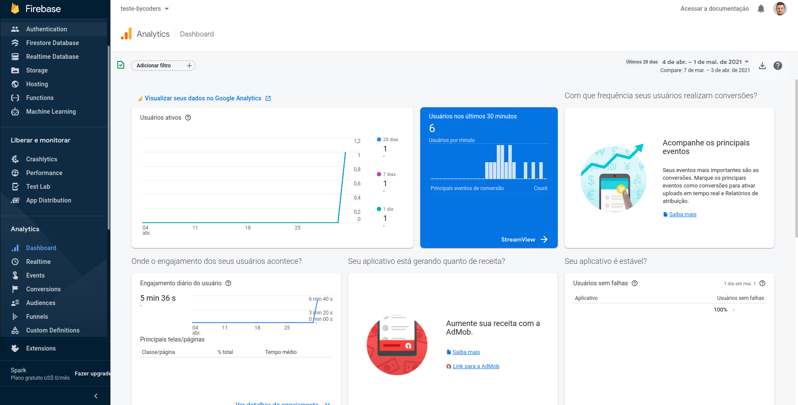
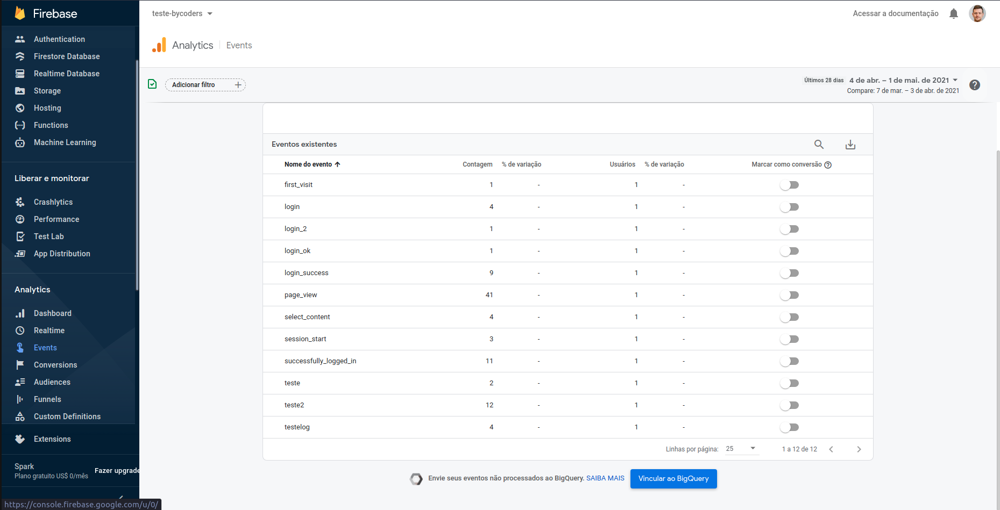
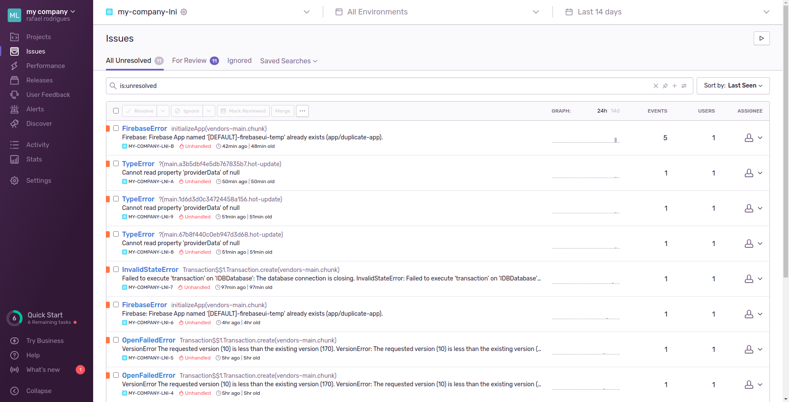
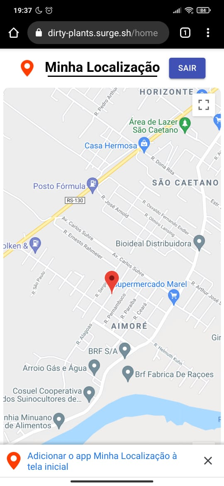

# Firebase Integration

## Deployed at: https://dirty-plants.surge.sh/

Note:

* The PWA works on both Android and iOS, in Chrome or Safari. On iOS the behavior is slightly different. To install the app (since the usual prompt doesn’t appear), tap Safari’s Share icon, then select “Add to Home Screen,” and finally tap “Add.”
Note: The line that enables the PWA is commented out because it caches roughly 200 MB on every successful login—and grows further as the map renders. To test with it enabled, uncomment line 23 (registerServiceWorker();) in index.js. You can clear the cache afterward.

### Login screen:

### Home screen:

### Firebase Auth:

### Firestore:

### Analytics:

### Sentry for errors:

### PWA:

